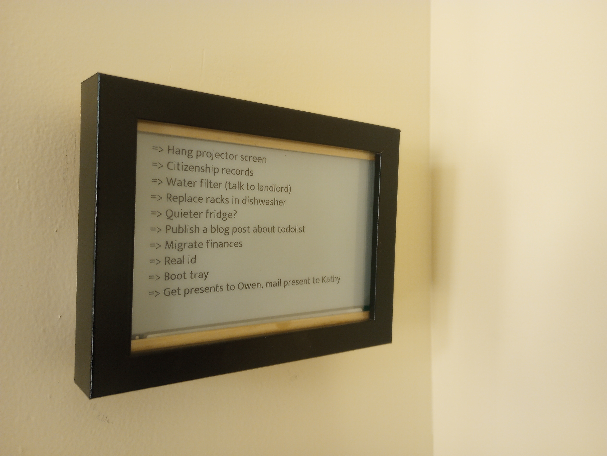
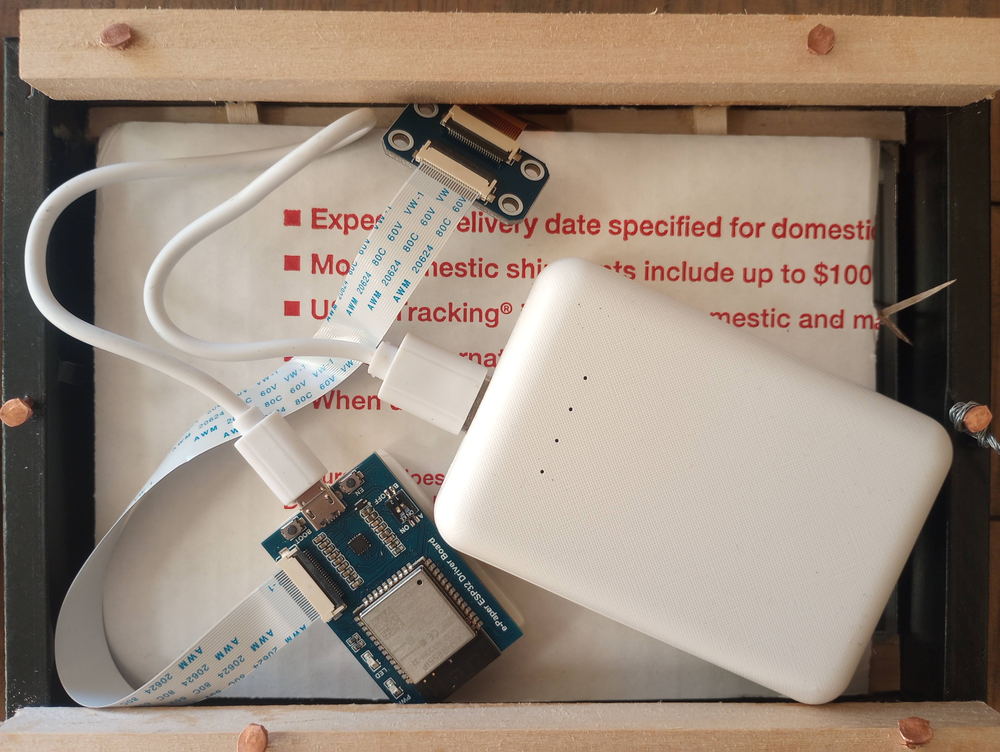

## Building an e-Ink ToDo list

First post!



## Materials

#### Hardware bill of materials:


|Name|Price|
|----|-----|
|[WaveShare 7.5 inch screen](https://www.waveshare.com/7.5inch-e-paper-g.htm)|$69.99|
|[WaveShare ESP32 Driver Board](https://www.waveshare.com/product/e-paper-esp32-driver-board.htm)|$14.99|
|[WaveShare Driver HAT](https://www.waveshare.com/product/e-paper-driver-hat.htm)|$9.99|
|[AdaFruit USB Battery Pack - 10000mAh](https://www.adafruit.com/product/1566)|$39.95|
|[Tindie Power Bank Keep Alive](https://www.tindie.com/products/plop211/power-bank-keep-alive-based-on-555-timer-smd/)|$13.50|
|HomeAssistant base station (consider [ODroid](https://www.home-assistant.io/installation/odroid))||
|A frame that can display 6.5" x 3.9"||

### Software

Home Assistant
ESPHome
CloudFlare
NameCheap
Todoist (API, Android App)

## Physical Setup

### Electronics

Connect the screen to the driver board (don't get any cables backwards, this wasted 4 hours of my life). Connect the driver board to the cable (even if the cable says it's a data cable, it might not be. This wasted 4 hours of my life.) Connect the cable to a keep-alive board (this delayed me 2 weeks waiting for a part...). Connect the keep-alive board to the power bank.

### Frame
I used a TODO: dimensions frame from Michaels. Unfortunately, my power bank was too thick, so I added some extra depth to it. I also added some spacers to hold everything in place, and a bit of cardboard between the display and the rest of the electronics.

## Digital Setup

Home Assistant: steps to describe (link to starting documentation).
Set up ESPHome
Set up a CloudFlare tunnel
Set up device on ESPHome, download the binary.
Set up esphomeflasher, to flash basic setup on the waveshare board.

### Set up Todoist, retrieve your API Token

### Config for Home Assistant
```
sensor:
  - platform: command_line
    name: todo_list
    scan_interval: 30
    command: >
      echo "{\"tasks\":" $(
      curl -X GET https://api.todoist.com/rest/v2/tasks -H 'Authorization: Bearer REDACTED'
      ) "}"
    value_template: > 
      {{ value_json.tasks | length }}
    json_attributes:
      - tasks
    unique_id: 'todoist_tasks'
  - platform: template
    sensors:
      item0: 
        value_template: " {{states.sensor.todo_list.attributes.tasks[0].content }}  "
      item1: 
        value_template: " {{states.sensor.todo_list.attributes.tasks[1].content }}  "
      item2: 
        value_template: " {{states.sensor.todo_list.attributes.tasks[2].content }}  "
      item3: 
        value_template: " {{states.sensor.todo_list.attributes.tasks[3].content }}  "
      item4: 
        value_template: " {{states.sensor.todo_list.attributes.tasks[4].content }}  "
      item5: 
        value_template: " {{states.sensor.todo_list.attributes.tasks[5].content }}  "
      item6: 
        value_template: " {{states.sensor.todo_list.attributes.tasks[6].content }}  "
      item7: 
        value_template: " {{states.sensor.todo_list.attributes.tasks[7].content }}  "
      item8:
        value_template: " {{states.sensor.todo_list.attributes.tasks[8].content }}  "
      item9: 
        value_template: " {{states.sensor.todo_list.attributes.tasks[9].content }}  "
```

### Config for ESPHome

```
font:
  - file: "gfonts://Mukta"
    id: roboto
    size: 32
    glyphs: "!\"%()+=,-_.:°0123456789ABCDEFGHIJKLMNOPQRSTUVWXYZ abcdefghijklmnopqrstuvwxyz'>?/&"

spi:
  clk_pin: 13
  mosi_pin: 14

text_sensor:
  - platform: homeassistant
    name: "todo0"
    entity_id: sensor.item0
    id: todo0
  - platform: homeassistant
    name: "To-do List 1"
    entity_id: sensor.item1
    id: todo1
  - platform: homeassistant
    name: "To-do List 2"
    entity_id: sensor.item2
    id: todo2
  - platform: homeassistant
    name: "To-do List 3"
    entity_id: sensor.item3
    id: todo3
  - platform: homeassistant
    name: "To-do List 4"
    entity_id: sensor.item4
    id: todo4
  - platform: homeassistant
    name: "To-do List 5"
    entity_id: sensor.item5
    id: todo5
  - platform: homeassistant
    name: "To-do List 6"
    entity_id: sensor.item6
    id: todo6
  - platform: homeassistant
    name: "To-do List 7"
    entity_id: sensor.item7
    id: todo7
  - platform: homeassistant
    name: "To-do List 8"
    entity_id: sensor.item8
    id: todo8
  - platform: homeassistant
    name: "To-do List 9"
    entity_id: sensor.item9
    id: todo9

display:
  - platform: waveshare_epaper
    cs_pin: 15
    dc_pin: 27
    busy_pin: 25
    reset_pin: 26
    model: 7.50inV2
    reset_duration: 2ms
    update_interval: 10sec
    lambda: |-
      int x = 36;
      it.printf(x, 0, id(roboto), "=> %s", id(todo0).state.c_str());
      it.printf(x, 40, id(roboto), "=> %s", id(todo1).state.c_str());
      it.printf(x, 80, id(roboto), "=> %s", id(todo2).state.c_str());
      it.printf(x, 120, id(roboto), "=> %s", id(todo3).state.c_str());
      it.printf(x, 160, id(roboto), "=> %s", id(todo4).state.c_str());
      it.printf(x, 200, id(roboto), "=> %s", id(todo5).state.c_str());
      it.printf(x, 240, id(roboto), "=> %s", id(todo6).state.c_str());
      it.printf(x, 280, id(roboto), "=> %s", id(todo7).state.c_str());
      it.printf(x, 320, id(roboto), "=> %s", id(todo8).state.c_str());
      it.printf(x, 360, id(roboto), "=> %s", id(todo9).state.c_str());

deep_sleep:
  run_duration: 60s
  sleep_duration: 60min
```

### Add device to Home Assistant

TODO: note about glyphs
TODO: add better logging for glyphs, link commit improving error message
TODO: note about how to upload during deepsleep
TODO: link to manual and note about how to determine pins
